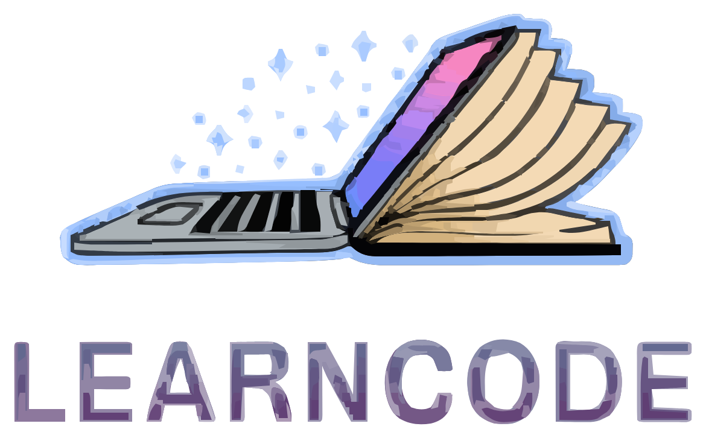
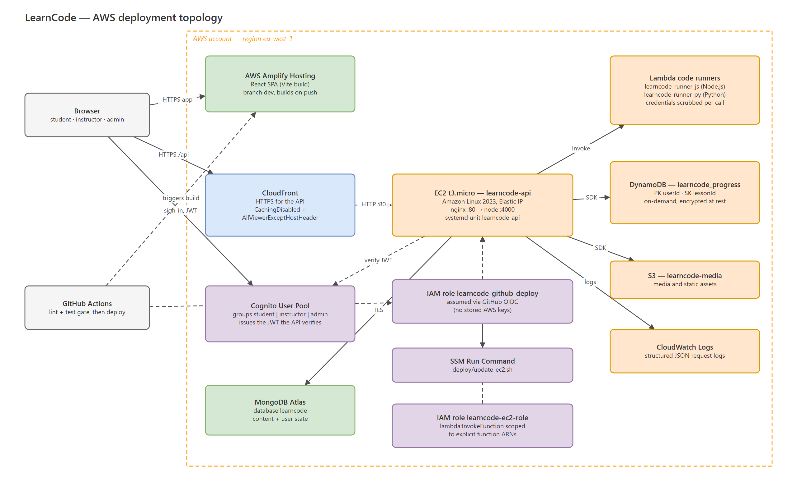

<div align="center">



**An interactive learning platform for programming education — MERN stack on AWS.**

[**Open the platform →**](https://dev.d35i2f5rxki35f.amplifyapp.com)

[](https://github.com/ANASTASIA-KESISI/Interactive-learning-platform-using-MERN-and-AWS/actions/workflows/ci.yml)


</div>

---

LearnCode bridges two things that are usually separate: the **institutional
flexibility** of an open LMS like Moodle or Canvas, and the **interactive
pedagogy** of a coding platform like Codecademy or LeetCode.

An institution models its own universities, departments and semesters. A
learner gets an in-browser editor that runs their code in a sandbox and tells
them whether it was right — with progressive hints, quizzes, notes, and enough
gamification to make coming back tomorrow feel worthwhile.

It is the practical artifact of an MSc thesis at the **University of Macedonia**
(2026), and is built to be evaluated: every learner interaction emits an event,
because the study correlates scaffold usage and gamification with engagement.

## What it does

|  | Feature |
|---|---|
| ⌨️ | **In-browser code execution.** Monaco editor, validated against an expected output. Learner code runs in an AWS Lambda sandbox — never in the API process. |
| 🪜 | **Progressive scaffolding.** Hints reveal one at a time, each reveal is recorded, and each one discounts the XP the lesson pays out. |
| 🧪 | **Quizzes.** A quiz is just a lesson with questions and a pass mark, graded server-side — the answer key never reaches the browser. |
| 🏅 | **Gamification.** XP, 10 ranks, streaks, and **23 badges** across seven criteria — including ones for finishing without hints, and for taking notes. |
| 📊 | **Analytics.** Per-lesson pass rates, attempts, hint usage and time-on-task for instructors; progress and history for learners. |
| 🏛 | **Institutional structure.** Universities → departments → semesters, so courses land where a student expects them. |
| 📝 | **Notes and messaging.** Per-lesson notes, and a thread per (student, course) with the instructor. |
| 🔐 | **Three roles.** Student, instructor, admin — enforced in middleware, never trusted from the client. |

## Live

| | |
|---|---|
| **Platform** | https://dev.d35i2f5rxki35f.amplifyapp.com |
| **API health** | https://d3n7zqt9fcw62k.cloudfront.net/health |

> The API's `/health` reports the running commit, so it is the quickest way to
> tell what is actually deployed.

## Architecture

Four layers, each talking only to its neighbours — a route handler never
reaches into DynamoDB, and a component never assembles a view from five
endpoints.

```
┌──────────────────────────────────────────────────────────────┐
│ Client       React 18 SPA · Vite · Tailwind · Monaco         │
├──────────────────────────────────────────────────────────────┤
│ API          Express · stateless · JWT + RBAC middleware     │
├──────────────────────────────────────────────────────────────┤
│ Services     one module per domain, all business logic       │
├──────────────────────────────────────────────────────────────┤
│ Data         MongoDB Atlas · DynamoDB · S3                   │
└──────────────────────────────────────────────────────────────┘
```

**Polyglot persistence, on purpose.** Content goes to Mongo — read often,
written rarely. Events go to DynamoDB — written on every click, submission and
hint reveal. Collapsing them into one store would trade away either the query
shape or the write throughput.

<div align="center">
  
</div>

📐 **[Full architecture reference →](docs/ARCHITECTURE.adoc)** ·
[PDF](docs/ARCHITECTURE.pdf) ·
[data model figures](docs/) ·
[editable diagram](docs/learncode-architecture.drawio)

## Stack

| Layer | Technology |
|---|---|
| **Frontend** | React 18, React Router, Vite, Tailwind CSS, Monaco Editor, Recharts |
| **Backend** | Node.js, Express, Mongoose, Jest |
| **Databases** | MongoDB Atlas (content) · DynamoDB (events) |
| **Identity** | AWS Cognito user pools, groups mapped to roles |
| **Compute** | EC2 (API, behind nginx) · Lambda (code runners, one per language) |
| **Delivery** | Amplify (client) · CloudFront (HTTPS for the API) · S3 (media) |
| **Ops** | CloudWatch · GitHub Actions with OIDC · SSM Run Command |

## Getting started

**You need** Node.js ≥ 18, a MongoDB connection string, and AWS credentials for
any path touching Cognito, DynamoDB or Lambda.

```bash
git clone https://github.com/ANASTASIA-KESISI/Interactive-learning-platform-using-MERN-and-AWS.git
cd Interactive-learning-platform-using-MERN-and-AWS
npm install                      # npm workspaces — installs client and server
```

Configure the environment from the example at the repository root — it holds
both halves, server variables and the `VITE_*` ones the client needs:

```bash
cp .env.example .env      # then fill in MONGODB_URI, Cognito and AWS settings
```

The server reads, in order of precedence: the real process environment, then
`server/.env`, then the root `.env`. Client `VITE_*` variables are inlined at
**build** time, so changing one needs a rebuild rather than a restart.

Run both halves in separate terminals:

```bash
npm run dev:server        # API on :4000
npm run dev:client        # client on :5173
```

> `CLIENT_ORIGIN` on the server must match the client's origin exactly. If the
> client starts on a different port because 5173 is taken, CORS will reject
> every request and the app will report a network error.

## Commands

```bash
npm run dev:server        # API with hot reload
npm run dev:client        # Vite dev server
npm run test:server       # Jest — 342 tests
npm run lint              # ESLint across both workspaces

# from server/
npm test -- <pattern>     # a single file or test-name pattern
node scripts/seedBadges.js        # upsert the 23 badges
node scripts/seedUniversities.js  # the institutional tree
```

## Project layout

```
client/          React SPA
  public/badges/   badge artwork, one SVG per badge
  src/features/    one directory per feature area
server/
  src/routes/      thin handlers — parse, call a service, format
  src/services/    all business logic
  src/models/      Mongoose schemas
  src/dynamo/      the progress table
  scripts/         seeders and one-shot maintenance
  tests/           Jest
docs/            architecture reference, diagrams and their generator
deploy/          systemd unit, nginx site, EC2 setup script
```

## Testing

```bash
npm run test:server
```

342 Jest tests covering services, routes and middleware. Mongoose and the AWS
SDK are mocked, so the suite asserts behaviour rather than persistence and needs
no live infrastructure.

There is **no client test suite yet** — CI lints and builds the frontend but
runs no tests against it.

## Deployment

Pushing to `dev` is the whole deployment. GitHub Actions gates on lint and
tests, then assumes an IAM role through OIDC — no stored AWS keys — and rolls
the API via SSM Run Command, while Amplify rebuilds the client independently.

The Lambda code runners deploy manually on purpose: they change rarely, and the
one component that executes untrusted code should not have an automated path
into it.

📗 **[Deployment runbook →](DEPLOYMENT.md)**

## Documentation

| Document | Contents |
|---|---|
| [`docs/ARCHITECTURE.adoc`](docs/ARCHITECTURE.adoc) | Layers, data model, AWS configuration, security, CI/CD, and the requirements traceability table |
| [`DEPLOYMENT.md`](DEPLOYMENT.md) | Runbook, IAM policies, environment variables, pre-pilot checklist |
| [`CHALLENGES.md`](CHALLENGES.md) | Problems hit during construction and how they were resolved — including a sandbox escape found by testing the deployed runner that static review had missed |
| [`REFACTOR.md`](REFACTOR.md) | The pre-deployment hardening review and its implementation record |
| [`SOLUTION_SKETCH.md`](SOLUTION_SKETCH.md) | Original design sketch and sprint roadmap |

## Status

Feature-complete and deployed, ahead of a time-bound pilot with MSc students
evaluated by the System Usability Scale plus engagement metrics from DynamoDB.

Known gaps, stated plainly: no client test suite; WCAG 2.1 AA has not been
formally audited; local development currently shares the production database;
course analytics use a filtered `Scan`, which is fine at pilot scale and not
beyond it.

> **Note.** Active development happens on `dev`, which is what is deployed.
> `main` is behind.

---

<div align="center">
<sub>MSc thesis artifact · University of Macedonia · 2026</sub>
</div>
