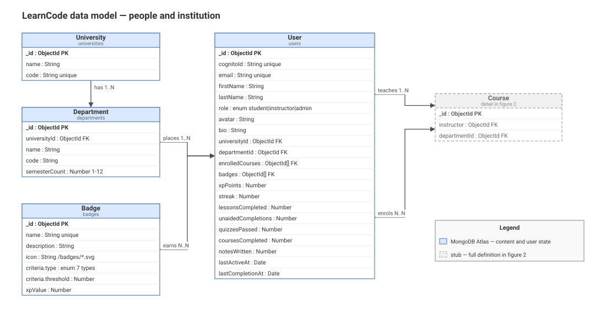
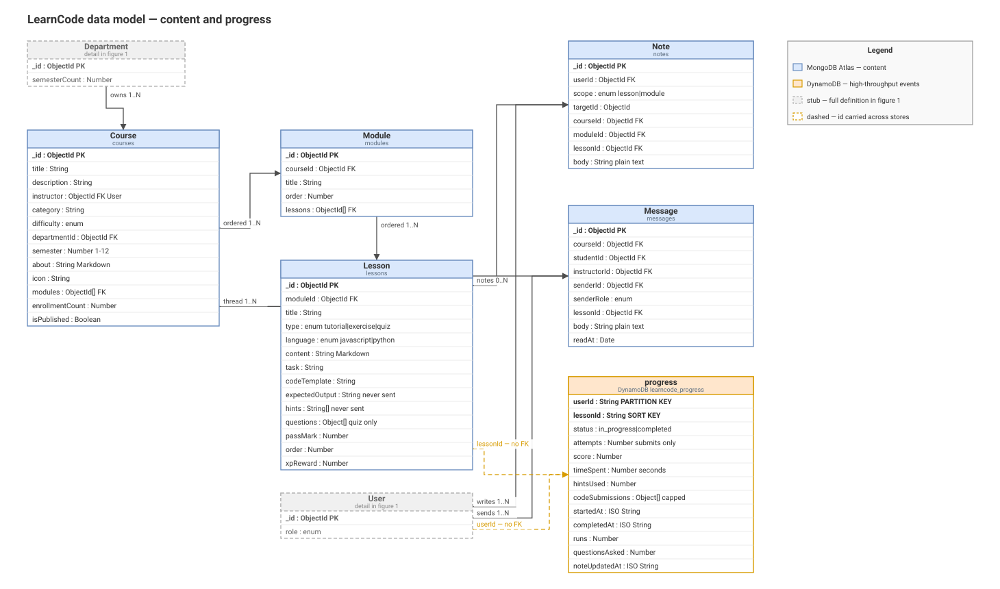
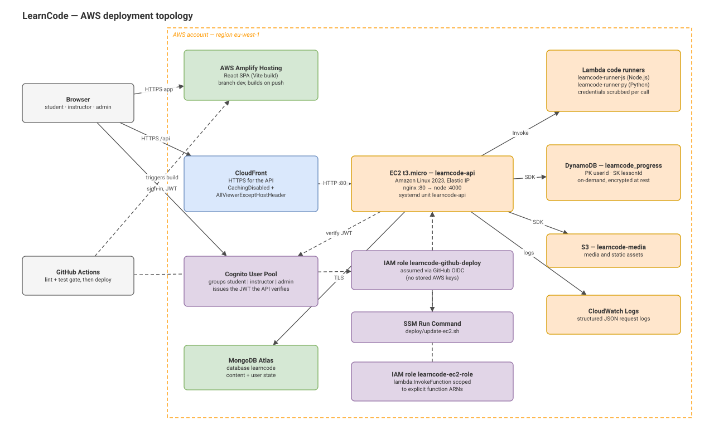

= LearnCode — System Architecture
:toc: left
:toclevels: 3
:sectnums:
:sectnumlevels: 3
:icons: font
:source-highlighter: rouge
:experimental:

[abstract]
LearnCode is a full-stack interactive learning platform for programming
education, built as the practical artifact of an MSc thesis at the University
of Macedonia. This document describes the system as built: its layers, its
data model, and the AWS configuration it runs on.

It is the *architecture* reference. Two neighbouring documents cover the rest:
`DEPLOYMENT.md` is the operational runbook and holds the concrete resource
identifiers, and `CHALLENGES.md` records the problems hit during construction
and how they were resolved.

== Purpose and scope

The platform sets out to bridge two things that are normally separate: the
institutional flexibility of an open LMS such as Moodle or Canvas, and the
interactive pedagogy of a commercial coding platform such as Codecademy or
LeetCode. An institution can model its own universities, departments and
semesters; a learner gets an in-browser editor that executes their code and
tells them whether it was right.

Three research concepts are implemented as first-class platform features rather
than as incidental UI:

Scaffolding:: Progressive hints and code templates. A hint is revealed one at a
time, the reveal is recorded, and it discounts the XP the lesson pays out.
Formative feedback:: Automated validation against an expected output, with the
error message surfaced to the learner rather than a bare pass/fail.
Self-regulated learning:: Progress visualisation, notes, and lightweight
gamification — XP, levels, ranks, streaks and badges.

The design intent matters when extending the system. A hint is not a UI
affordance; it is a scaffolding mechanism that must be revealed progressively
and tracked in the analytics, because the pilot study correlates scaffold usage
with engagement.

== Context

Three roles share one application shell, which adapts to the role claim on the
authenticated user.

[cols="1,3",options="header"]
|===
| Role | What they do

| Student
| Enrols in courses, works through lessons, runs and submits code, takes
quizzes, reveals hints, writes notes, messages the instructor, accrues XP and
badges.

| Instructor
| Authors courses, modules and lessons; publishes them; reads per-lesson
analytics for their own courses; answers student messages.

| Admin
| Manages users and their roles, publishes or unpublishes any course, maintains
the institutional tree of universities and departments, and reads
platform-level KPIs.
|===

Role checks in the frontend are for presentation only. Every protected route
re-validates the role server-side; a role claim from the client is never
trusted.

== Architectural overview

The system is a four-layer cloud-native application. Each layer talks only to
its neighbours — a route handler never reaches into DynamoDB, and a React
component never assembles a view out of five resource endpoints.

[source]
----
┌──────────────────────────────────────────────────────────────┐
│ Layer 1 — Client        React 18 SPA, Vite, Tailwind, Monaco │
├──────────────────────────────────────────────────────────────┤
│ Layer 2 — API           Express, stateless, JWT + RBAC       │
├──────────────────────────────────────────────────────────────┤
│ Layer 3 — Services      business logic, one module per domain│
├──────────────────────────────────────────────────────────────┤
│ Layer 4 — Data          MongoDB Atlas · DynamoDB · S3        │
└──────────────────────────────────────────────────────────────┘
----

The decision to render on the client rather than server-side is deliberate:
the platform is entirely behind authentication and has no SEO surface, so the
usual argument for SSR does not apply.

== Layer 1 — Client

A React 18 single-page application, built by Vite and deployed to AWS Amplify.

It is a single-page application in the strict sense: one HTML shell with a
single mount point, one script entry, and every route declared client-side in
`App.jsx` under a `BrowserRouter`. Vite emits a static bundle that Amplify
serves; nothing is rendered on a server. The one hosting consequence is the
rewrite rule that sends 404s to `index.html`, so a deep link such as
`/admin/users` survives a refresh.

[cols="1,3",options="header"]
|===
| Concern | Choice

| Routing | React Router, with route guards per role
| Styling | Tailwind CSS
| Editor | Monaco — the same engine as VS Code, so the editing experience is familiar
| Charts | Recharts, for the student dashboard and instructor analytics
| State | React context for the session; server state fetched per screen
|===

=== Primary screens

Navigation is Home · Courses · Notes · Profile, with Authoring added for
instructors and Admin for admins.

Student dashboard:: XP, streak, completion rate, badges, enrolled-course cards
with progress bars, recent activity.
Lesson page:: Three panes — a tabbed left panel (Lesson / Challenge / Notes),
the editor with a test-results panel in the middle, and the output console on
the right. Stacks vertically on narrow screens. A non-exercise lesson keeps the
reading layout plus its notes section.
Notes:: Every note the learner has saved, with its course, module and lesson
context, opening into an editable detail view.
Profile:: Identity, level and rank, stats, the full badge gallery, a year-long
activity heatmap, and enrolled or authored courses.
Admin panel:: Sidebar navigation, platform KPIs, weekly-active-users chart,
user management, universities and departments.

=== Client-side telemetry

The lesson page runs a time-on-task clock (`useTimeOnTask`). It counts only
time while the document is visible and flushes increments to the API, so a tab
left open unattended contributes nothing. This is the distinction between
time-on-task, which the evaluation reports, and wall-clock elapsed, which an
idle tab would inflate for free.

=== Accessibility

NFR5 asks for WCAG 2.1 AA. The automated part of that was measured on
2026-09-13 with Lighthouse 13.4 (axe-core 4.13) in headless Chrome, against the
deployed build and a local production build of the same commit; the two agreed
exactly. The reports are in `docs/lighthouse/`.

[cols="2,1,3",options="header"]
|===
| Page | Score | Automated failures

| Login | 100 | None
| Student signup | 100 | None
| Instructor signup | 100 | None
|===

The first run scored 97–98 with one failure shared by all three pages: no
`<main>` landmark, so assistive technology had nothing to jump to. The app
shell already wrapped signed-in pages in `<main>`; the public pages did not.
Fixed the same day and re-measured at 100.

Two limits on what the number means. Only the public pages were measured,
because every other screen sits behind Cognito and no test account exists for
tooling. And Lighthouse automates roughly a third of the standard; the ten
manual checks it lists — focus order, keyboard traps and the like — still need
a human pass. The defensible claim, and the one made throughout these
documents, is that the platform is *designed toward WCAG 2.1 AA and validated
with automated tooling*. Conformance is not claimed.

== Layer 2 — API

A stateless Express application. Statelessness is what makes horizontal
scaling possible: any instance can serve any request, because the session
lives entirely in the JWT.

=== Middleware pipeline

Order matters, and this is the order:

. `helmet` — security headers
. `cors` — a single allowed origin, from `CLIENT_ORIGIN`, with credentials
. `express.json` — body parsing, capped at 1 MB
. `requestLogger` — structured JSON lines, so CloudWatch Logs Insights can
   query them (skipped under test)
. `express-rate-limit` — 120 requests per minute per IP across `/api`
. per-route `requireAuth`, then `requireRole([...])`
. `attachUser` — resolves the Mongo user document from the token's `cognitoId`
. `errorHandler` — maps thrown service errors to status codes

`trust proxy` is enabled in production, because the API sits behind CloudFront
and nginx; without it the rate limiter would see one proxy IP for every caller
and throttle the whole platform as if it were a single user.

=== Endpoint design

Endpoints are organised around what a role needs to accomplish, not around the
shape of the tables. `GET /api/student/dashboard` returns the aggregated view
the dashboard screen needs, in one round-trip, rather than making the client
compose it from five resource endpoints.

[cols="1,3",options="header"]
|===
| Router | Responsibility

| `/health` | Liveness, plus the deployed commit and timestamp
| `/api/auth` | Sign-up completion, instructor role claim
| `/api/me` | The profile aggregate: identity, gamification, stats, badges
| `/api/universities` | The institutional tree
| `/api/student` | Dashboard, activity, progress
| `/api/courses` | Catalogue, course detail, enrolment, leaderboard
| `/api/lessons` | Lesson delivery, hint reveal, run, submit, quiz, time-on-task
| `/api/notes` | Learner notes
| `/api/messages` | Student ↔ instructor threads
| `/api/instructor` | Authoring and per-course analytics
| `/api/admin` | User management, course publication, badges, KPIs
|===

== Layer 3 — Services

Route handlers are thin: parse input, call one or more services, format the
response. Business logic lives in the services.

[cols="1,3",options="header"]
|===
| Service | Responsibility

| `authService`
| Delegates identity to Cognito. Owns role changes, which are Cognito group
moves. No password ever reaches this codebase.

| `courseService`
| The course → module → lesson hierarchy, and the two lesson projections: the
authoring view, and the learner view that withholds the answers. A course is
publishable only if it has at least one module and every module has at least
one lesson — one rule, enforced on both the instructor's publish and the
admin's toggle. A course can be deleted only while unpublished, by its owner
or an admin; the delete cascades in Mongo (lessons, modules, notes, messages,
enrolments) but leaves DynamoDB progress records in place as the pilot's
research record.

| `progressService`
| Every learner interaction: completion, attempts, hints, runs, submissions,
time on task, questions asked, note activity. Writes to DynamoDB.

| `gamificationService`
| XP accrual with the hint discount, streaks, badge award rules, and the
derived level and rank functions.

| `codeRunnerService`
| Sandboxed execution of learner code, and validation against the expected
output. A thin orchestrator over two adapters.

| `quizService`
| Server-side grading of quiz answer sheets against the pass mark.

| `profileService`
| The `/api/me` aggregate.

| `universityService`
| The institutional tree plus admin CRUD.

| `noteService`
| Learner notes, one per (user, lesson) or (user, module).

| `messageService`
| One thread per (student, course).

| `leaderboardService`
| Per-course ranking by XP earned inside that course, over a rolling window.
|===

=== The code runner

This is the one service that handles genuinely untrusted input, so it gets its
own treatment. Learner code is *never* executed in the API process.

[cols="1,3",options="header"]
|===
| Environment | Adapter

| Production
| AWS Lambda, one function per language. Isolation is AWS's microVM boundary.

| Local development
| Node `vm` isolates, opt-in only. Not a real sandbox — see the note below — which is why it can never be selected by default.
|===

The adapter is chosen by environment variable at boot, and the choice fails
*closed*: an unset, empty or unrecognised value resolves to Lambda, never to
the in-process adapter. `vm2` is deliberately not used — it was deprecated in
2023 after repeated sandbox-escape CVEs.

[IMPORTANT]
====
An adversarial test against the deployed runner escaped the Node `vm` sandbox
via `console.log.constructor('return process')()` and returned the Lambda
execution role's live STS credentials. The blast radius was contained — a basic
execution role, inside a microVM — but the fix, scrubbing AWS credential
variables from the environment on every invocation, was ported to both runners.
Static review had not found it. See `CHALLENGES.md`.
====

== Layer 4 — Data

Two databases, chosen for different workloads. They are not to be collapsed
into one without a strong reason.

[cols="1,1,2",options="header"]
|===
| Store | Workload | Contents

| MongoDB Atlas
| Read often, written rarely
| Structured content and user state: the institutional tree, courses, modules,
lessons, users, badges, notes, messages.

| DynamoDB
| Written on every interaction
| Learner progress events: attempts, completions, hints, runs, time, code
submissions.
|===

The rule of thumb is *content goes to Mongo, events go to Dynamo*. A new piece
of data that is read often and written rarely belongs in Mongo; anything
written on every click, submission or hint reveal belongs in Dynamo.

Two properties follow from the split and are worth stating explicitly:

* There are no foreign keys between the stores. The `userId` and `lessonId` on
  a progress item are ids carried across the boundary by application code, not
  database references — which is why they are drawn dashed in the diagram.
* Level and rank are *derived, never stored*. `gamificationService.levelFromXp`
  computes them from `xpPoints` on every read. A stored copy would drift the
  moment XP was adjusted.

== Data model

The entity diagram lives in `docs/learncode-architecture.drawio`, split across
the first two of its three pages:

. *Data model — people*: the institutional tree, the user, and badges.
. *Data model — content*: courses, modules, lessons, notes, messages, and the
  DynamoDB progress table.
. *AWS topology*: the deployment, described in the next section.

The split is for legibility — all ten entities on one page is 1700px wide, and
at 100% on a portrait page the field text stops being readable. Each
relationship is drawn on exactly one page, on the side that owns it; the entity
at the far end appears there as a greyed stub so the line still has something
to land on.

Both figures are rendered below. They are generated — `docs/generate-diagrams.js`
emits the `.drawio` and the SVGs from one description of the layout, so the
editable source and the figures cannot drift apart. See `docs/README.md` to
regenerate them.

.Figure 1 — people and institution

.Figure 2 — content and progress

To edit rather than read: open `learncode-architecture.drawio` at
https://app.diagrams.net[app.diagrams.net] (menu:File[Open from ▸ Device]) or
with the *Draw.io Integration* extension in VS Code — but change the generator
and re-run it, or the next regeneration will overwrite the edit.

=== Collections at a glance

[cols="1,3",options="header"]
|===
| Collection | Notes

| `universities`
| Name and unique code. The root of the institutional tree.

| `departments`
| Belongs to one university. `semesterCount` bounds the semester a course may
declare; semesters are plain integers, not documents.

| `users`
| Profile, `cognitoId`, role, institutional placement, enrolments, and the
gamification counters. No password — identity is Cognito's.

| `courses`
| Metadata, instructor, department and semester, ordered modules, publication
state.

| `modules`
| Ordered within a course; holds ordered lessons.

| `lessons`
| Where the scaffolding lives: Markdown content, the challenge brief, code
template, expected output, ordered hints, XP reward, and — for a quiz — its
questions and pass mark.

| `badges`
| Award criteria and XP value. Seven criteria types, each backed by a counter
on the user document.

| `notes`
| One per (user, lesson) or (user, module). Plain text, never rendered as
Markdown or HTML.

| `messages`
| One thread per (student, course). Plain text.
|===

=== The progress table

A single DynamoDB table, partition key `userId` and sort key `lessonId`. The
composite key answers both of the questions the application asks — "this
learner's whole history" and "this learner on this lesson" — in one round-trip.

The table is not defined in code. It was created in the console, and its name
reaches the API through the `DYNAMO_PROGRESS_TABLE` variable; `DEPLOYMENT.md`
holds the identifier.

Three of its attributes exist to keep the pilot's headline metric honest.
`runs`, `questionsAsked` and `noteUpdatedAt` record engagement that is
deliberately *not* folded into `attempts`: only a submit is an attempt, so
experimenting with the Run button cannot dilute the pass-rate denominator.
All three are optional, and every reader tolerates their absence, so records
written before they existed remain valid.

=== Answers never leave the server

`expectedOutput`, hint text, and a quiz question's `correctIndex` and
`explanation` are the answers to the exercise. Shipping them to the browser
would let a learner read the solution out of the network tab and pass by
echoing it — corrupting exactly the pass-rate and hint-usage data the study
evaluates. So:

* `expectedOutput` never leaves the server; validation happens in the runner.
* Hints are exposed as a count. The text arrives only from the reveal
  endpoint, which records the reveal.
* Quiz questions travel without their answer key; grading is server-side and
  feedback returns with the result.

== AWS configuration

Figure 3 draws what follows.

.Figure 3 — AWS deployment topology
 Concrete resource identifiers live in `DEPLOYMENT.md`, deliberately in
one place rather than repeated here.

Everything is in a single region, `eu-west-1`.

[source]
----
browser ──https──> Amplify (React SPA)
browser ──https──> CloudFront ──http──> EC2:80 nginx ──> node:4000
                                                          ├──> MongoDB Atlas
                                                          ├──> DynamoDB
                                                          ├──> Lambda runners
                                                          ├──> S3
                                                          └──> CloudWatch Logs
----

=== Amplify Hosting — the client

Builds the SPA from the repository on every push to `dev` and serves it over
HTTPS.

Two configuration points that are easy to get wrong:

* It must *not* be configured as a monorepo with `client` as the app root. The
  build installs at the workspace root; the `amplify.yml` at the repository
  root handles this.
* `VITE_*` variables are inlined at *build* time, not read at runtime, so
  changing one requires a rebuild.

The SPA fallback is a `200` rewrite: any path without a file extension is
served `index.html`, while real assets pass through. This replaced Amplify's
default `/<*>` rule of type `404-200` on 2026-09-13. That default did serve
`index.html` for deep links, so users never noticed, but it answered a 301 to
a trailing-slash URL and then a 404 status, which crawlers, uptime probes and
Lighthouse all read as a broken page. `DEPLOYMENT.md` has the rule and the
curl check.

=== CloudFront — HTTPS for the API

The API runs on EC2 over plain HTTP; CloudFront terminates TLS in front of it,
which satisfies the HTTPS-everywhere requirement without managing certificates
on the instance.

Its configuration is *not* the default, and the defaults are actively wrong
here because they are tuned for static content:

[cols="1,2",options="header"]
|===
| Setting | Value and why

| Origin
| The instance's public DNS name. CloudFront will not accept a bare IP.

| Cache policy
| `CachingDisabled`. The default would serve one learner's API response to
another.

| Origin request policy
| `AllViewerExceptHostHeader`. The default strips the `Authorization` header,
which would make every authenticated request fail.

| Methods
| All HTTP methods allowed, or writes never reach the origin.
|===

WAF was deliberately declined: it carries a standing monthly cost, and
`express-rate-limit`, helmet and Cognito already cover this threat model.

=== EC2 — the API host

A single `t3.micro` running Amazon Linux 2023 with an Elastic IP. nginx listens
on port 80 and proxies to the Node process on 4000; the process is a systemd
unit, so it restarts on failure and on boot.

Access is through *Session Manager*, not SSH. The security group admits SSH
only from a fixed home IP, and browser-based EC2 Instance Connect originates
from AWS ranges that the same rule blocks — so the console's default Connect
tab fails while Session Manager works from anywhere.

Secrets live in a root-owned `chmod 600` environment file read by the systemd
unit. They are never committed.

=== Lambda — the code runners

One function per language, each holding the untrusted-code boundary.

[cols="1,1,2",options="header"]
|===
| Function | Runtime | Notes

| `learncode-runner-js` | Node.js | Registered from a built-in default name
| `learncode-runner-py` | Python | Registered *only* when its function name is configured
|===

The asymmetry is deliberate. JavaScript is the pilot language and is assumed
present everywhere. Python is opt-in, so an environment without the function
deployed rejects a Python submission at dispatch with a 503 that names the
missing variable — rather than letting the call reach AWS and return an opaque
`ResourceNotFoundException`.

[NOTE]
====
Deploying a runner is not enough to make its language work. The function name
must also be configured wherever the API runs. This cost real debugging time
once; the refusal is now an explicit 503 rather than a bare 500.
====

=== DynamoDB — the progress table

On-demand capacity, partition key `userId`, sort key `lessonId`, encrypted at
rest by default.

Analytics currently read it with a filtered `Scan`. At pilot scale — thirty
learners and a few hundred items — that is acceptable and simpler than the
alternative. Past that scale the fix is a global secondary index on `lessonId`,
not a different aggregation.

Item size is bounded deliberately: submitted code is capped and the submission
array is trimmed, because a DynamoDB item cannot exceed 400 KB and an
unbounded history of submissions would eventually hit it.

=== S3 — media

Reserved, not yet used. The bucket name is configured in the API's
environment and the backend identity holds S3 access, but no code path reads
or writes it: `config/aws.js` builds an S3 client that no service calls, and
badge artwork ships inside the client bundle. S3 stays in the design for
lesson media; its honest present status is idle.

=== Cognito — identity

A user pool with three groups — `student`, `instructor`, `admin` — which map
directly to the application roles. The group membership becomes a claim in the
JWT.

The backend never stores a password and never issues a token. Role changes are
group moves performed through the admin API, which clears stale role groups
before adding the new one.

Becoming an instructor is gated by an institutional invite code held in the
API's environment. Without a valid code the account is created as a student and
an administrator can grant the role later; the sign-up does not fail.

=== CloudWatch — logs and metrics

CloudWatch is used for logs only. The API writes one JSON line per request —
method, route, status, duration and the caller's role — plus structured
application events, to stdout and stderr. On the instance, systemd stores both
streams in the journal. The CloudWatch agent cannot read the journal, so a
small companion unit tails it into a file that the agent ships to the log group
`/learncode/api`; `deploy/setup-cloudwatch.sh` installs the pieces without
touching the API process. Lambda and Amplify ship their own logs without
configuration.

Live on the instance since 2026-09-13: log group `/learncode/api`, one stream
per instance, 90-day retention. `DEPLOYMENT.md` section 7 has the setup for a
fresh host and the one systemd trap it works around.

Request bodies, query strings, tokens and the `authorization` header are never
logged: bodies carry learner source code, and the rest would put secrets in a
log group.

Because the lines are JSON, Logs Insights queries fields directly instead of
parsing free text. The per-route latency query in `DEPLOYMENT.md` is how NFR3
is checked.

One alarm exists: a metric filter counts request lines with `status >= 500`,
and `learncode-api-5xx` emails a person when that count is at least one in a
five-minute period, since 2026-09-13. There are no dashboards and no other
alarms; the next worth adding are Lambda errors and throttles for the runners,
and DynamoDB throttled requests.

=== IAM

Two identities need the same runtime policy, and updating one does not affect
the other:

[cols="1,2",options="header"]
|===
| Identity | Used by

| An IAM *user* | Local development, via keys in the developer's environment file
| An IAM *role* on the instance | The deployed API
|===

The policy scopes `lambda:InvokeFunction` to explicit function ARNs rather than
a wildcard. The consequence is worth knowing before it bites: *every new
language runner requires widening the policy in both places*, or the API gets
`AccessDeniedException` while a Console test of the same function passes.

== Authentication and authorisation

. The client authenticates against Cognito and receives a JWT.
. Every protected route runs `requireAuth`, which validates the token's
  signature, issuer and expiry against the pool's published keys.
. `requireRole([...])` then checks the group claim against the permission
  matrix for that route.
. `attachUser` resolves the Mongo user document from the token's `cognitoId`.

Authorisation is enforced in middleware, not in handlers, so a new route cannot
accidentally omit it by forgetting an `if`. Ownership checks that middleware
cannot express — "is this your course?" — live in the services and throw a
403 rather than returning someone else's data.

== Security posture

[cols="1,3",options="header"]
|===
| Control | Implementation

| Transport | HTTPS end to end. TLS terminates at CloudFront and at Amplify.
| Tokens | Cognito-issued and Cognito-expired, refreshed by the client SDK.
| Input validation | Server-side on every endpoint; ids are validated before reaching Mongo, so a malformed id is a 400 rather than a cast error surfacing as a 500.
| RBAC | Middleware, ahead of every handler.
| Rate limiting | 120 requests per minute per IP across `/api`.
| Encryption at rest | Atlas and DynamoDB defaults; S3 bucket encryption.
| Untrusted code | Executed only in Lambda in production, never in the API process.
| Secrets | Host environment file, `chmod 600`, never committed. CI uses OIDC rather than stored AWS keys.
| Answer leakage | Expected outputs, hint text and quiz answer keys never reach the browser.
| Mass assignment | Writable fields are picked explicitly on instructor and admin endpoints rather than spread from the request body.
|===

Changes touching authentication, input handling or code execution are checked
against the OWASP Top 10 before merging.

== Continuous integration and deployment

Pushing to `dev` is the whole deployment process.

[source]
----
push to dev
   ├─ GitHub Actions
   │    ├─ Server — lint & test        ┐ both must pass
   │    ├─ Client — lint, test & build ┘
   │    └─ Deploy API to EC2
   │         ├─ assume IAM role via GitHub OIDC (no stored keys)
   │         └─ SSM Run Command → deploy script on the instance
   └─ Amplify rebuilds the client independently
----

The Lambda runners are deployed manually, on purpose: they change rarely, and
an automated path would add a deployment surface for the one component that
executes untrusted code.

Three traps are documented in `DEPLOYMENT.md` and worth repeating:

* An SSM Run Command session has no `$HOME`, unlike an interactive Session
  Manager shell. Anything assuming one — `git config --global`, npm's cache
  directory — fails there and only there.
* nginx refuses a configuration whose `server_name` is longer than its default
  hash bucket, which an EC2 public DNS name comfortably exceeds.
* *A red deploy job does not mean the code did not ship.* Install and restart
  happen before verification, so a failure in the verification step leaves the
  new commit live. `/health` reports the running commit; that is the ground
  truth, and it is the first thing to check.

=== Test suites

Both workspaces run Jest, and CI runs both suites before the deploy job may
start.

[cols="1,1,3",options="header"]
|===
| Suite | Size | Scope

| Server
| 342 tests, 21 files
| Services, routes and middleware. Mongoose and the AWS SDK are mocked, so the
suite asserts behaviour rather than persistence and needs no live
infrastructure.

| Client
| 20 tests, 4 files
| The display helpers, the `BadgeIcon` fallback logic and the `useTimeOnTask`
hook, run in jsdom with React Testing Library. Babel is configured inline in
`client/jest.config.cjs` so it cannot reach the Vite build, which runs its own.
No page-level component is tested yet; the production build is the regression
signal for those.
|===

== Observability

`GET /health` returns liveness, Mongo connectivity, uptime, and the deployed
commit and timestamp. Comparing its `commit` against the branch is the fastest
way to establish what is actually running.

Application logs are structured JSON in CloudWatch, and a 5xx alarm emails a
person within five minutes of the API failing a request. Uptime for the pilot
is targeted at 99.5%.

== Environments and configuration

Configuration precedence is *real environment variables first*, then the
server's environment file, then the repository root's.

This ordering was a bug fix, not an accident. The loader previously applied the
file with override semantics, so a developer's checked-out file beat the
platform's injected variables — `NODE_ENV=production` silently resolved to
`development`, and no platform variable could take effect. The runner adapter
now also fails closed, so a mis-set variable cannot quietly select the
in-process sandbox in production.

[WARNING]
====
Local development and production currently share one MongoDB database.
Anything created while testing locally — courses, lessons, notes, messages,
role changes — is production data the moment the matching code deploys.
Splitting out a separate development database is the obvious hardening step and
has not been done.
====

== Evaluation metrics

The pilot is evaluated with the System Usability Scale plus engagement metrics
drawn from the progress table. The thesis names five engagement metrics. This
is what the platform produces for each, checked against the code rather than
the design.

[cols="2,1,3",options="header"]
|===
| Thesis metric | Status | Where it comes from

| Lesson-completion rate
| Reported
| `passRate` per lesson and `overallCompletionRate` per course from
`GET /api/instructor/courses/:id/analytics`; `completionRate` on the student
dashboard and profile.

| Mean code submissions per exercise
| Derivable
| `totalAttempts` and `uniqueLearners` per lesson are returned; the mean is
their ratio. The per-submission transcript is in the research export.

| Hint usage frequency
| Reported
| `avgHintsUsed` per lesson. Each stored submission also carries
`hintsUsedAtSubmit`, so attempts before and after a hint can be compared.

| Badge acquisition rate
| Partial
| Badges are awarded server-side and counted per user (`badgeCount` and
`badgeTotal`), but `users.badges[]` holds IDs without an award timestamp. The
rate can be computed per cohort at export time; it cannot be plotted over time.

| Average session duration
| Not as sessions
| There is no session record. What exists is `timeSpent` per lesson — active
time on task from `useTimeOnTask`, exposed as `avgTimeSpentSec` — and
`lastActiveAt` per user, which drives the weekly-active-users chart. The honest
label is "average time on task per lesson".
|===

Beyond the five, the table records `runs` (unvalidated executions),
`questionsAsked` and `noteUpdatedAt`, and the admin panel reports user totals
by role and users active per week.

The offline dataset for the analysis comes from
`server/scripts/exportSubmissions.js`. It replaces the Mongo user ID with a
stable `learner-NN` token and writes no names, emails or Cognito IDs; the
re-identification key is opt-in and written to a separate file.

== Requirements traceability

[cols="1,2,2",options="header"]
|===
| Ref | Requirement | Where it lives

| FR1 | Authentication and RBAC | Cognito, `requireAuth` + `requireRole`
| FR2 | Interactive editor with execution and validation | Monaco, `codeRunnerService`, Lambda
| FR3 | Course → module → lesson hierarchy | `courseService`, Mongo
| FR4 | Scaffolded hints and formative error messages | `lessons` collection, reveal endpoint
| FR5 | XP, badges, streaks, progress | `gamificationService`
| FR6 | Analytics dashboard | `progressService.getCourseAnalytics`, Recharts; metric coverage in the evaluation-metrics section
| FR7 | Instructor course creation | `/api/instructor`
| FR8 | Admin tools | `/api/admin`
| NFR1 | Responsive desktop and mobile | Tailwind breakpoints; panes stack on narrow screens
| NFR2 | Horizontally scalable | Stateless API; session lives in the JWT
| NFR3 | Primary interactions under 3 s | Aggregated endpoints; warm Lambda invocations measured in tens of milliseconds
| NFR4 | HTTPS/TLS everywhere | CloudFront and Amplify
| NFR5 | WCAG 2.1 AA | Designed toward AA and validated with automated tooling (Lighthouse 100 on the public pages); conformance not claimed — see gaps below
| NFR6 | 99.5% uptime during the pilot | systemd restart; CloudWatch logs and the API 5xx alarm
|===

== Known gaps

Stated plainly, because an architecture document that only describes intent is
less useful than one that says where the system falls short.

[cols="1,3",options="header"]
|===
| Gap | Detail

| Thin client test suite
| The client has 20 tests over its display helpers, one component and the
time-on-task hook. No page-level component is tested; the production build in
CI is the regression signal for those. The backend has full unit and
integration coverage.

| WCAG 2.1 AA: designed toward, validated with automated tooling, not formally audited
| Lighthouse scores the public pages 100 (2026-09-13, after the missing
`main` landmark was fixed). The authenticated screens have not been
measured, and the manual checks that make up most of the standard have not been
done, so conformance is not claimed. Individual measures are in place —
`prefers-reduced-motion` is honoured, status regions are announced, controls
are labelled.

| Shared development database
| See the warning above.

| Analytics scan
| Course analytics use a filtered `Scan`, which is fine at pilot scale and not
beyond it.

| One alarm only
| The API 5xx alarm is the only one. A throttled or failing Lambda runner, or
DynamoDB throttling, is still found by reading logs rather than by being told.
No dashboards.

| Session duration not measured
| The thesis lists average session duration; the platform records active time
on task per lesson and a last-seen timestamp per user. Either the thesis
wording changes to time on task, or session tracking is added.

| Badges not timestamped
| `users.badges[]` is a list of IDs. Acquisition can be counted but not placed
in time, so a badge-acquisition curve cannot be drawn from the current data.

| Progress table outside infrastructure-as-code
| The DynamoDB table was created in the console and its schema lives only there.
Recreating the environment means recreating it by hand.

| No admin activity log
| Administrative actions are not recorded to an audit trail.

| Mobile untested on device
| The layout is responsive and has been exercised in a browser, but not on real
hardware.
|===

== Related documents

[cols="1,3",options="header"]
|===
| Document | Contents

| `DEPLOYMENT.md` | The runbook: deploy steps, IAM policies, environment variables, the pre-pilot checklist, CI/CD setup and troubleshooting. Holds the concrete resource identifiers.
| `docs/AWS-SERVICES.md` | Service by service: what each AWS service does for the platform, what was created on it, how the code touches it, what was deliberately not used, and the traps met along the way.
| `CHALLENGES.md` | Problems encountered during construction and how they were resolved, by sprint. The source for the thesis's implementation chapter.
| `SOLUTION_SKETCH.md` | The original design sketch and sprint roadmap.
| `REFACTOR.md` | The pre-deployment hardening review and its implementation record.
| `docs/generate-diagrams.js` | Emits the editable `.drawio` and the three SVG figures from one layout description.
| `docs/README.md` | How to regenerate the diagrams, the HTML and the PDF.
|===
